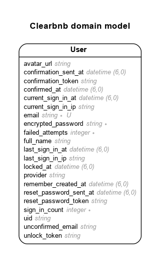

# Clearbnb

Project similar to Airbnb. Book short term rentals.


Live - https:// [TODO]

## TODO

- Install webpacker
  - $ rails webpacker:install
  - nodenv local 14.7.0

## Model

TODO:

- Listings table
  - title
  - about:text
  - max_guests:integer
  - host:references
  - latitude
  - longitude
  - address_line1
  - address_line2
  - city
  - state
  - postal_code
  - country
  - type (cabin, farm, apartment, condo, hut, yurt, treehouse, trailer)
- Geolocation
  - Stimulus
- Reviews

Generated by Rails ERD. Run rails erd to regenerate (must have graphviz).



## Version

- ruby 3.1.2
- rails 7.0.4

## Setup Instructions

- Install PostgreSQL

```sh
sudo apt update
sudo apt install postgresql postgresql-contrib libpq-dev
```

- In Development Mode, prevent installation of production gems

```sh
$ bundle config set --local without 'production'
$ bundle install
$ bundle lock --add-platform x86_64-linux
```

## Deployment Instructions

- Add User/Role and Database. The name must be the same as your username in Ubuntu. For production it will be deploy. If deploy User/Role already exits, skip this step

```sh
sudo -u postgres createuser -s deploy -P
sudo -u postgres createdb deploy
```

-s = Add the superuser privilege<br>
-P = Password creation prompt

- Install App Dependencies on Production

```sh
bundle config set --local deployment 'true'
bundle config set --local without 'development test'
bundle install
```

- Create DB on Production

```sh
RAILS_ENV=production rails db:create
RAILS_ENV=production bundle exec rake assets:precompile db:migrate
sudo service nginx reload
```

- View DB exists:

```sh
psql
\l
```

\l - list all databases
\q - quit

## References

- Youtube
  - https://www.youtube.com/watch?v=Lut1C6CHDCE
  - Devise Google Login With Omniauth - https://www.youtube.com/watch?v=CnZnwV38cjo
- Google SSO - https://blog.devgenius.io/how-to-add-google-sign-in-sso-with-devise-to-a-ruby-on-rails-7-app-6d8c5ef7641b
- Places Autocomplete - https://developers.google.com/maps/documentation/javascript/examples/places-autocomplete-addressform
- Format .rb files with prettier - https://github.com/prettier/plugin-ruby/issues/113
  ```sh
  cd ~/.vscode/extensions/esbenp.prettier-vscode-1.8.1/
  npm install @prettier/plugin-ruby
  ```
- Humanize Select from enum - https://dev.to/masroorhussainv/enum-dropdown-with-capitalized-values-in-rails-144j
- Create new stimulus controller named room (room_controller.js)
  `rails g stimulus room`
- Install Active Storage
  - `rails active storage:install`
  - `rails db:migrate`
  - `sudo apt install libvips ffmpeg`
  - importmap.rb:
    `pin "@rails/activestorage", to: "activestorage.esm.js"`
  - application.js:
    ```js
    import * as ActiveStorage from "@rails/activestorage";
    ActiveStorage.start();
    ```
