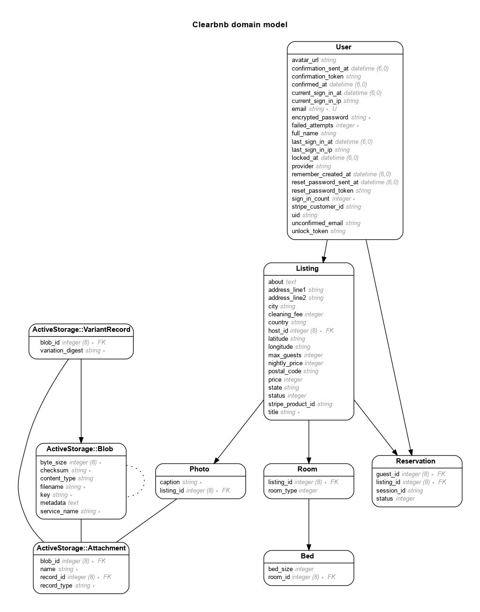

# Clearbnb

Project similar to Airbnb. Book short term rentals.


Live - https:// [TODO]

## TODO

- Install webpacker
  - $ rails webpacker:install
  - nodenv local 14.7.0

## Model

Generated by Rails ERD. Run rails erd to regenerate (must have graphviz).



## Version

- ruby 3.1.2
- rails 7.0.4

## Setup Instructions

- Install PostgreSQL

```sh
sudo apt update
sudo apt install postgresql postgresql-contrib libpq-dev
```

- In Development Mode, prevent installation of production gems

```sh
$ bundle config set --local without 'production'
$ bundle install
$ bundle lock --add-platform x86_64-linux
```

## Deployment Instructions

- Add User/Role and Database. The name must be the same as your username in Ubuntu. For production it will be deploy. If deploy User/Role already exits, skip this step

```sh
sudo -u postgres createuser -s deploy -P
sudo -u postgres createdb deploy
```

-s = Add the superuser privilege<br>
-P = Password creation prompt

- Install App Dependencies on Production

```sh
bundle config set --local deployment 'true'
bundle config set --local without 'development test'
bundle install
```

- Create DB on Production

```sh
RAILS_ENV=production rails db:create
RAILS_ENV=production bundle exec rake assets:precompile db:migrate
sudo service nginx reload
```

- View DB exists:

```sh
psql
\l
```

\l - list all databases
\q - quit

## References

- Youtube - https://www.youtube.com/watch?v=Lut1C6CHDCE
